# Apollo Workbench for VS Code

The Apollo Workbench extension lets you design your schemas using [Apollo Federation](https://www.apollographql.com/docs/federation) and Schema Definition Language (SDL). This extension exposes the functionality of [`rover`](https://www.apollographql.com/docs/rover/) for GraphOS in a friendly VS Code way.

For more detailed documentation, visit our GitHub [docs page](https://apollographql.github.io/apollo-workbench-vscode/).

## Required Installations

**rover** - This extension requires the GraphOS CLI `rover` to be installed. Most of the functionality in the extension is based on various `rover` commands (like `rover supergraph compose`). There are [simple installation instructions](https://www.apollographql.com/docs/rover/getting-started) for various platforms to install `rover`.

## Getting Started

### Logging into GraphOS

1. Head to your personal settings in Apollo Studio and create a user API key
2. Click the login row or run the **GraphOS: Login** command form the VS Code command Pallete

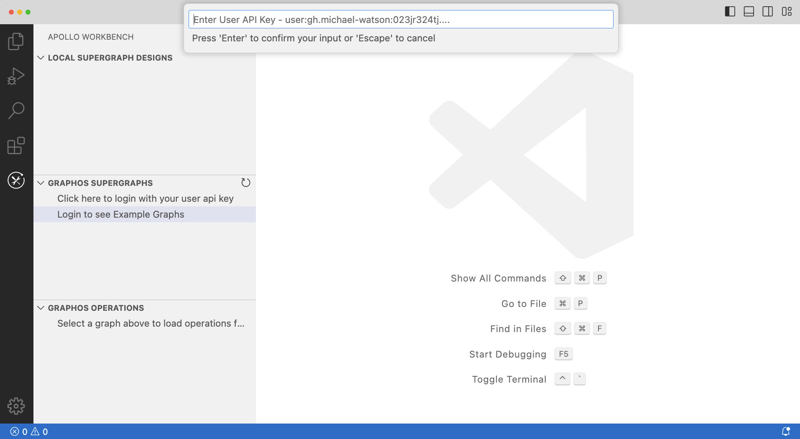

3. Paste your API key and hit 'Enter'. You should see a list of your graphs show up

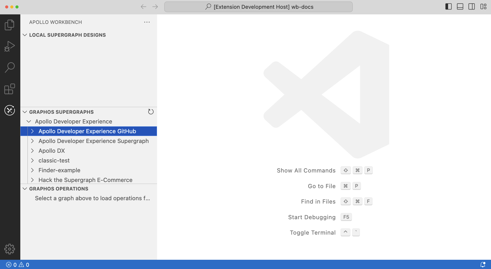

### Creating a new design from GraphOS

_You must login to GraphOS to create designs from the schema registry_

1. Find the graph you want to create a design from. You can right click the design and go through a wizard to select with environment (variant) to start from or expand the graph and right click on the environment:

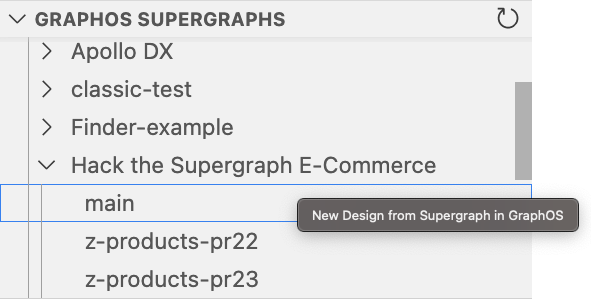

2. Provide a name for your new design:

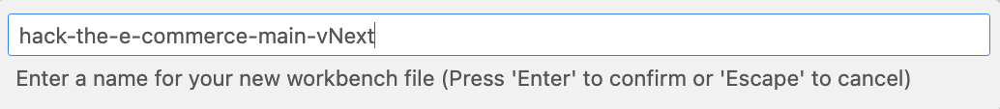

A new design should be displayed that is a copy from GraphOS. You should see a local `.yaml` file created that can be used with `rover supergraph compose` (assuming you are logged in with `rover`). Here is an example of the `yaml` that was output from the screenshot above:

```
subgraphs:
  users:
    routing_url: https://hts-users-production.up.railway.app/
    schema:
      graphref: hack-the-e-commerce@main
      subgraph: users
  shipping:
    routing_url: https://hts-shipping-production.up.railway.app/
    schema:
      graphref: hack-the-e-commerce@main
      subgraph: shipping
  reviews:
    routing_url: https://hts-reviews-production.up.railway.app/
    schema:
      graphref: hack-the-e-commerce@main
      subgraph: reviews
  products:
    routing_url: https://hts-products-production.up.railway.app/
    schema:
      graphref: hack-the-e-commerce@main
      subgraph: products
  orders:
    routing_url: https://hts-orders-production.up.railway.app/
    schema:
      graphref: hack-the-e-commerce@main
      subgraph: orders
operations: {}
federation_version: '=2.7.2'
```

### Creating a design from scratch

If you don't already have a schema in GraphOS or just want to play around, click the **+** button in the local supergraph designs section to create a blank `.yaml` file locally:

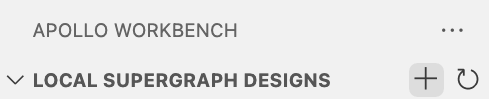

### Changing the federation version for a design

Since each design is just the `yaml` configuration required for `rover supergraph compose`, you can change the version in the file directly:

```
federation_version: '=2.3.5'
```

### Editing a subgraph schema

Depending on what you have in your `yaml` configuration, `rover` could be fetching the schema from a remote source or a local schema file (see `rover` [docs](https://www.apollographql.com/docs/rover/commands/supergraphs#composing-a-supergraph-schema) for details on sources). All remote data sources are initially read-only until you switch them to a local design:

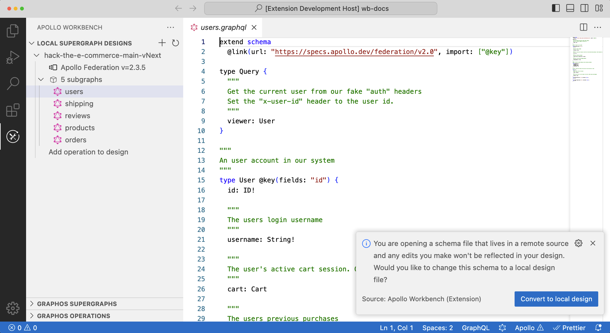

Once the schema has been selected to be changed, a local file will be created with that schema and a `workbench_design` will be added to your `yaml`. Having `workbench_design` present in the schema configuraiton will begin using the local file for `rover supergraph compose`:

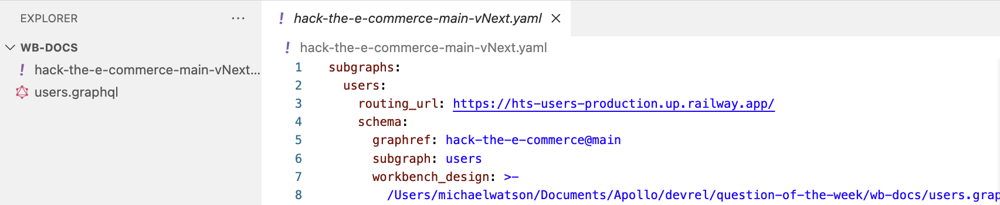

### Composing changes to designs

Once you save a schema file, workbench will run `rover supergraph compose` across your designs and display any errors into the problems panel:

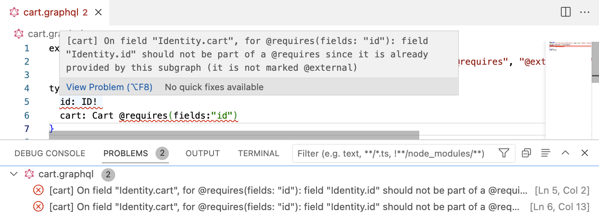

### Running designs locally with `rover dev`

You can start any design (that doesn't have composition errors) by pressing the "Play" icon when hovering over the subgraphs row. This will manage the `rover dev` session in VS Code terminal windows and open Sandbox in VS Code. You can also navigate to `http://localhost:3000` in your browser; VS Code webview is sometimes a little weird with the embedded UIs.

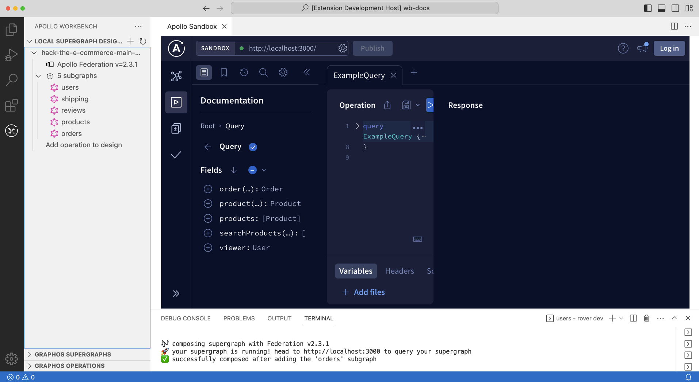

You can stop the design at anytime by pressing the "Stop" icon when hovering over the subgraphs row. Only one design can be running at a time.

### Mocking designs locally

By default, designs running locally will route traffic to the `routing_url` defined in the `yaml`. If you want to mock any schema, you can right click that schema and select "Mock Subgraph in Design":

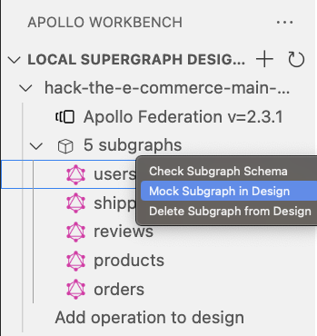

This will add a `file` property to your schema in the `yaml` file. If there isn't already a local `workbench_design` or a `file` already defined, a copy of the schema file will be created locally for that reference. Sometimes you may have both a `file` and `workbench_design` defined; for these cases you should always have them pointing at the same schema file.

The following configuration has a local design file being used for composition and to be mocked locally.

```
subgraphs:
  users:
    routing_url: https://hts-users-production.up.railway.app/
    schema:
      graphref: hack-the-e-commerce@main
      subgraph: users
      workbench_design: >-
        /Users/michaelwatson/Documents/Apollo/devrel/question-of-the-week/wb-docs/users.graphql
      file: >-
        /Users/michaelwatson/Documents/Apollo/devrel/question-of-the-week/wb-docs/users.graphql
```

**How the mocking works**: Workbench runs an `@apollo/server` instance locally for every subgraph schema you have mocked. A local schema file is required as part of this process to use `graphql-tools` to apply mocks locally. In this current beta there is no support for custom mocks, but that could change in the future.

### Checking subgraph schema changes

You can right click any subgraph schema and select "Check Subgraph Schema". This will run a wizard to get the necessary information to run `rover subgraph check` ([docs](https://www.apollographql.com/docs/rover/commands/subgraphs#checking-subgraph-schema-changes)) and report the results. Once complete, VS Code will prompty you to open the check report directly in Apollo Studio, the web interface for GraphOS.

### Associating an operation design with the Design

You can add operations to any design by pressing the "**+**" button on the operations row:

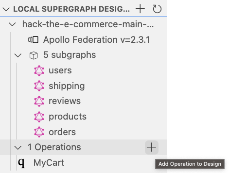

You can associate an image with your design now. Local files and urls are both supported. This enables you to pull up a query and what it's design looks like side by side.

### Adding an operation from GraphOS into the design

You can load operations from GraphOS by clicking on any graph in the "GRAPHOS SUPERGRAPHS" section of the extension. Then you can select the "**+**" button for that operation in "GRAPHOS OPERATIONS" and select which design to add it to.

### Opening a design in Apollo Explorer

There is a "Play" button for every defined operaiton. This will ensure the design is running locally and open Apollo Explorer embedded in VS Code with the given operation loaded in. After executing the operation once, you should be able to view the query plan.

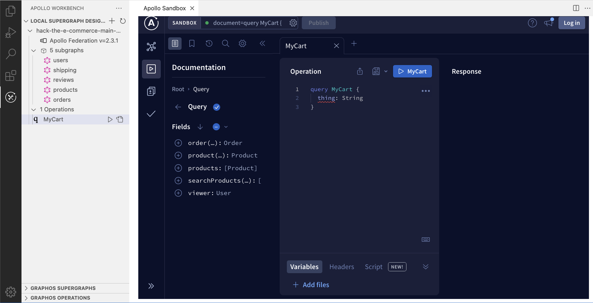

## VS Code extension output

You might be seeing some strange behavior. In these cases, you should check the extension output:

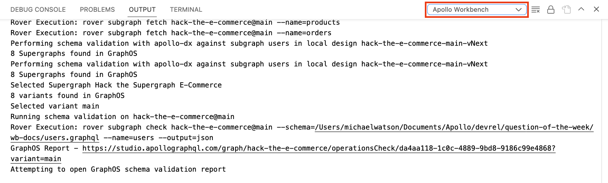

## Community

Are you stuck? Want to contribute? Come visit us in the [Apollo Discord!](https://discord.gg/graphos)

## Maintainers

- [Michael Watson](https://github.com/michael-watson/)

## Licensing

Source code in this repository is covered by the Elastic License 2.0 as designated by the LICENSE file in the root of the repository.

**_DISCLAIMER_**: This project is project is maintained by Michael Watson because they use it in schema design discussions regularly. There are many other people that use this tool, but it has been blocked from supporting any new Federation features for some time now. This was due to Federation v1 and v2 eventually requiring different versions of `graphql` making it impossible to have the `npm` packages installed to make Workbench work. Many pieces have been moving in the background to where now Workbench uses `rover` for almost all of it's functionality and the federation specific `npm` packages have been removed (`@apollo/subgraph` is still present to mock schemas locally). If you are interested in helping contribute to this project, feel free to reach out in our [Discord server](https://discord.gg/graphos).
