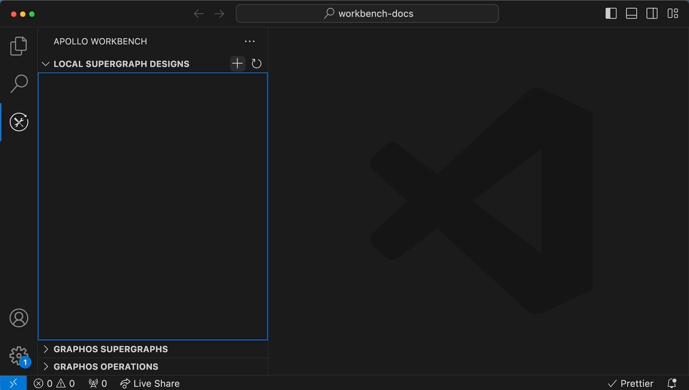
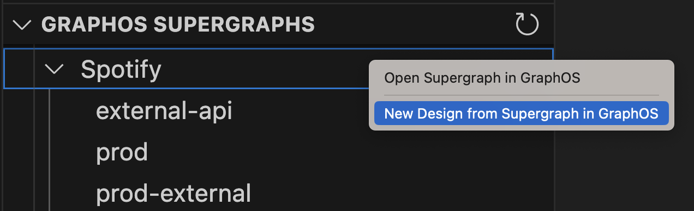
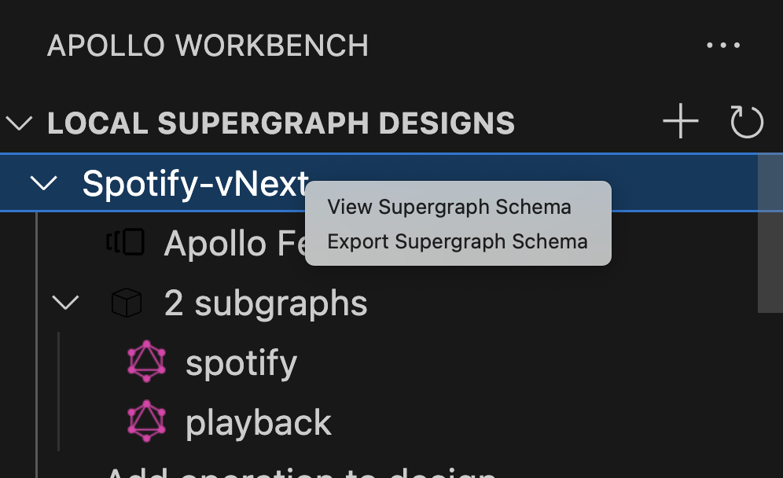
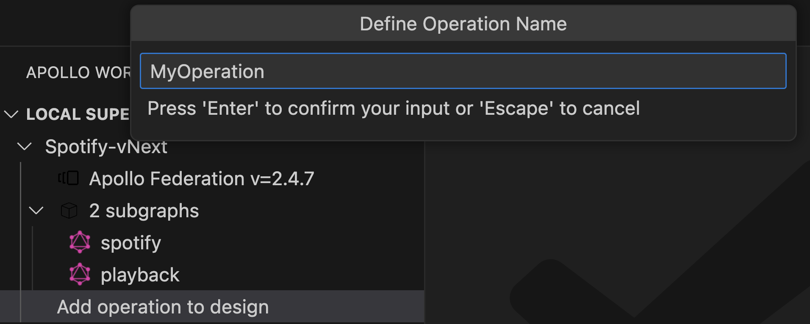
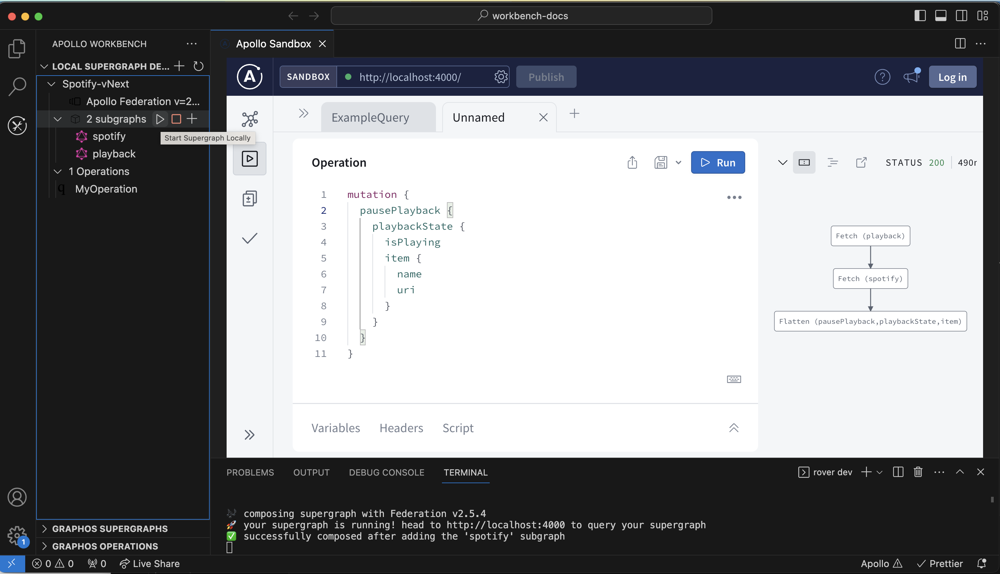
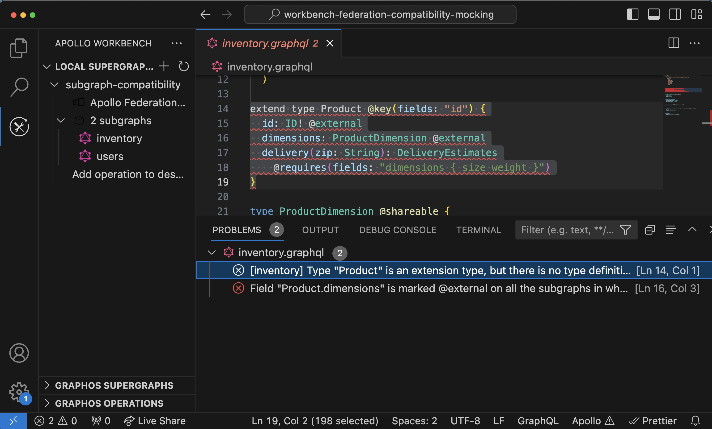

**Apollo Workbench** is a [VS Code extension](https://marketplace.visualstudio.com/items?itemName=apollographql.apollo-workbench) that helps you design and reason about your organization's graph without writing any server code.

Currently, Workbench is especially useful for working on _federated_ graphs. Whether you're creating a new graph or making changes to an existing one, Workbench helps you understand how your graph composes throughout the design process.

  <Button
    colorScheme="indigo"
    as={Link}
    to="./setup/"
  >
    Get started
  </Button>

## Create graphs

### Build graphs from scratch

Quickly create a new design and start adding subgraphs:

### Import graphs from Studio

After [authenticating Workbench with GraphOS](./setup/#authenticating-with-graphos), you can create local Workbench designs that are based on any GraphOS graph you have access to:

All subgraphs in the re-created design will default to read-only and you will have to convert them to a local design file if you want to edit them or mock them. You can do this through the prompt that is displayed when you open the schema.

### View supergraph and API schemas

Apollo Workbench runs `rover supergraph config` every time you save a design file.

As soon as you have a design that successfully composes, you can view its supergraph and API schemas:

These schemas update as you make changes to your subgraph schemas.

## Create operations

### Build operations from scratch

Click "Add operation to design" or the "+" button if you have more than one design. You can associate an image for the design that is sourced from a remote url or local file:

### Import operations from Studio

After [authenticating Workbench with Apollo Studio](./setup/#authenticating-with-apollo-studio), you can import operations that have been executed against any graph you have access to:

See [Importing operations](./import-studio-graph/#importing-operations).

### View query plans

You will need to start the design to access Apollo Explorer where you can view the query plans. Just press the play button for the design:

> Your design must compose successfully to be able to view query plan details.

## Debug your graph

### See composition errors in-line

Any composition errors in your design are displayed in both the VS Code editor and the Problems panel. This helps you understand conflicts and resolve them before writing any server code for your subgraphs:

### Run locally with mocks

See [Testing designs locally](./mocking/).

Ready to try it out? Continue to [Setup](./setup/).
