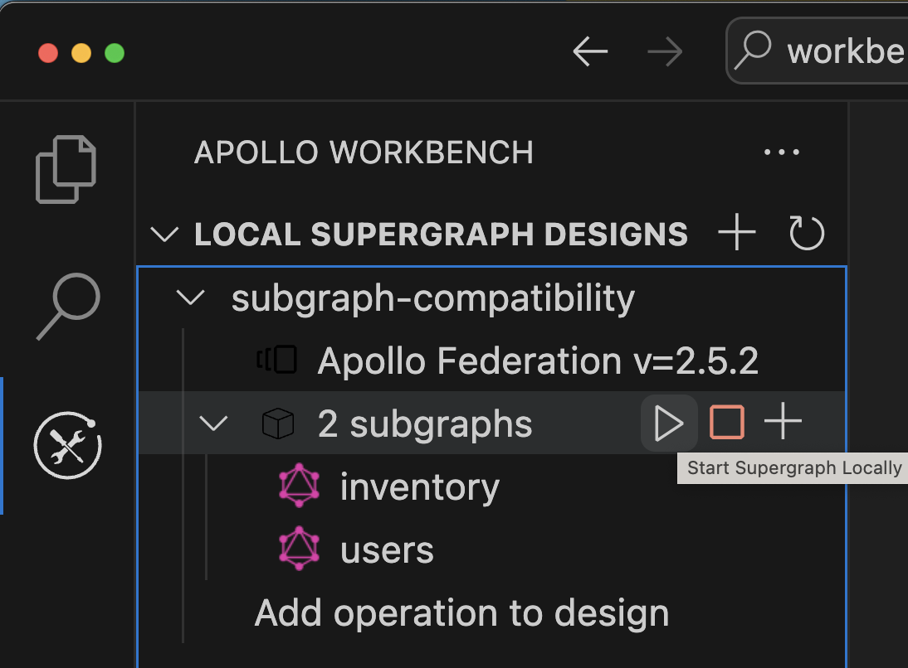
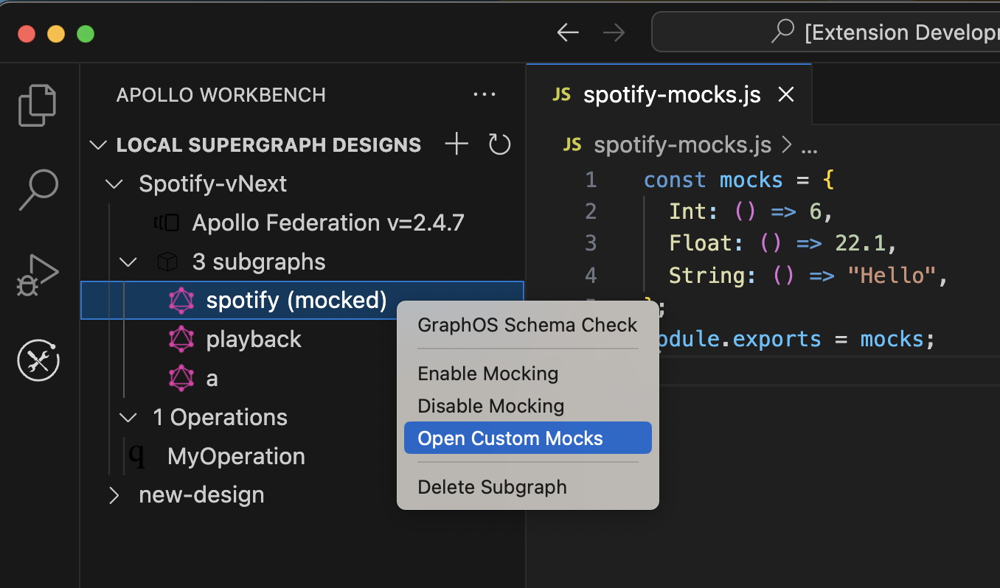

Apollo Workbench enables you to run a mocked version of any fully composing supergraph design on your local machine.

## Starting and stopping

To start your mocked supergraph locally, click the triangular Play button that appears when hovering over the subgraphs row in the navigation panel:



This utilizes [`rover dev`](https://www.apollographql.com/docs/rover/commands/dev) to run the supergraph locally with the Apollo Router. Apollo Sandbox will automatically open for you to write queries and view query plans.

To stop execution, click the square Stop button.

By default, the mocked supergraph gateway runs on port `4000`. Subgraph ports start with `4001` and increment by one (`4002`, etc.).

You can override these defaults by modifying your VS Code user settings (go to **Extensions > Apollo-Workbench** and click **Edit in settings.json**):

```json
{
  "apollo-workbench.gatewayPort": 4000,
  "apollo-workbench.startingServerPort": 4001
}
```

> You can only run one supergraph design at a time. Whenever you start a design, any other running design is stopped.

## Subgraph Mocking

All subgraphs can have mocking enabled by either right clicking a subgraph or adding the mocks to the subgraph yaml:

```yaml
users:
  routing_url: http://localhost:4002
  schema:
    file: users.graphql
    mocks:
      enabled: true
      customMocks: users-mocks.js
```

## Defining custom mocks

You can define custom mocks for any subgraph in [the same format Apollo Server expects for mocks](https://www.apollographql.com/docs/apollo-server/testing/mocking/). Access the custom mocks for any subgraph by right-clicking the subgraph name and selecting **Open Custom Mocks**:



> Custom mocks currently only work with a `.js` file that expects the ` mocks`` to be exported. The default new custom mocks contains the export for you. You can also import  `faker` if you want to customize your mocks.

### How do mocks work in Workbench?

When you run your design, Workbench starts one Apollo Server instance for each mocked subgraph in the design. Each instance dynamically creates reference resolvers for any entities that the subgraph defines. These resolvers are used in combination with any defined custom mocks to resolve incoming operations.

Workbench also runs the appropriate `rover dev` command to start the Apollo Router up locally.

When all server instances have started, Workbench opens Apollo Sandbox so you can execute operations against the router.

## Using non-mocked subgraphs

You can choose to mock _some_ of your subgraphs while the _rest_ of your subgraphs use actual GraphQL endpoint URLs. These URLs can be local or remote (such as the URL of a staging subgraph).

To specify a URL for a non-mocked subgraph, just set the `routing_url` in your yaml config:

```yaml
subgraphs:
  users:
    routing_url: http://domain:3000
```

> Workbench does not verify whether a subgraph's remote `url` is reachable.
