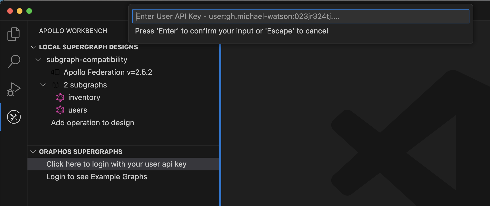

First, download the following required applications and extensions:

1. If you haven't yet, [install VS Code](https://code.visualstudio.com/download).
2. Install the [Apollo GraphQL VS Code Extension](https://marketplace.visualstudio.com/items?itemName=apollographql.vscode-apollo).
   - This extension provides code completion when writing schemas and queries.
3. Install the latest [Apollo Workbench release](https://marketplace.visualstudio.com/items?itemName=apollographql.apollo-workbench).
   - You can view past releases [here](https://github.com/apollographql/apollo-workbench-vscode/releases).
4. Install the [Rover CLI](https://www.apollographql.com/docs/rover/getting-started)

After you install the extension, it adds a Workbench icon to your VS Code Activity Bar.

The Workbench navigation panel is divided into three sections:

- **Local supergraph designs.** This lists all of the `.apollo-workbench` files contained in the directory VS Code is opened to.
- **GraphOS supergraphs.** This lists all of the graphs you have access to in GraphOS. You can use this list to create a new design based on an existing graph.
  - To populate this list, you need to [authenticate Workbench with Studio](#authenticating-with-graphos).
- **GraphOS operations.** This lists all of the GraphQL operations associated with whichever **GraphOS graph** is selected.

## Authenticating with GraphOS

Workbench can connect to GraphOS, enabling you to create designs based on your existing federated graphs. You can also push your local designs to Studio to create _new_ graphs.

To log in to Studio from Workbench:

1. Open VS Code to any folder.

2. Go to your [personal settings in GraphOS](https://studio.apollographql.com/user-settings) and [obtain a personal API key](https://www.apollographql.com/docs/studio/api-keys/#personal-api-keys).

3. From the Workbench tab in VS Code, click **Click here to login with your user api key**. (You can also run the `login` command in the command palette) Paste your API key into the input box:

This saves the API key to your VS Code extension state.

## Opening a folder in VS Code

You need to open a folder in VS Code to create designs in Workbench. Workbench uses this folder to store your designs.

## Viewing logs

Apollo Workbench prints informative logs as you use it. To view the logs, select **View > Output**. Then in the Output panel, select **Apollo Workbench** from the dropdown menu in the upper right.
